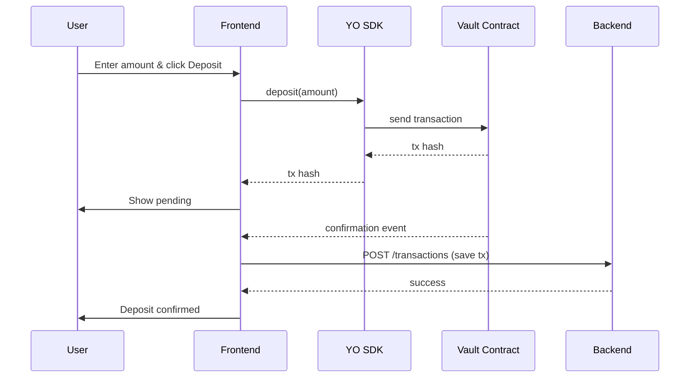

# YO Savings Widget

[](https://opensource.org/licenses/MIT)
[](https://reactjs.org/)
[](https://www.typescriptlang.org/)
[](https://vitejs.dev/)
[](https://www.npmjs.com/package/@yo-protocol/react)

A **mobile‑first savings widget** that lets users earn DeFi yields through YO Protocol vaults. Deposit, withdraw, and track your savings – all from your phone’s home screen, with real onchain transactions.

---

## 📖 Overview

The YO Savings Widget is a Progressive Web App (PWA) that abstracts away the complexity of DeFi savings. It integrates with YO vaults deployed on **Base**, **Ethereum**, and **Arbitrum**, allowing users to:

- Connect their wallet (MetaMask, WalletConnect)
- View available vaults with live APY and TVL
- Deposit assets and watch them grow
- Withdraw instantly or queue asynchronous redemptions
- Set up recurring deposits
- See transaction history

All interactions use the official **YO SDK** (`@yo-protocol/react`) and execute **real onchain transactions** – no simulations.

---

## ✨ Features

- **Wallet Connect** – Sign‑In with Ethereum (SIWE) + JWT authentication
- **Multi‑Chain Vaults** – Browse YO vaults on Base, Ethereum, Arbitrum
- **Real Balances** – Live asset amounts, daily yield, APY
- **Deposit & Withdraw** – Immediate or async redemptions with clear UX
- **Recurring Deposits** – Schedule daily/weekly/monthly savings
- **Transaction History** – Store off‑chain for easy access
- **PWA** – Installable on mobile home screens, works offline
- **Cross‑Chain Awareness** – Deposit from any supported chain (via Enso routing)

---

## 🛠 Tech Stack

### Frontend
- **React 18** + **TypeScript**
- **Vite** – fast builds and HMR
- **Tailwind CSS** – utility‑first styling
- **ethers v5** – blockchain interactions
- **YO SDK** – `@yo-protocol/react` for vault integration
- **SIWE** – Sign‑In with Ethereum
- **PWA** – `vite-plugin-pwa`

### Backend (optional)
- **Node.js** + **Express**
- **MongoDB** + **Mongoose** – user profiles, recurring settings, transactions
- **JWT** – authentication
- **node‑cron** – recurring deposit scheduler (conceptual)

---

## 🏗 Architecture

### High‑Level System Diagram

```mermaid
graph TB
    subgraph Frontend (PWA)
        A[React Components]
        B[WalletContext]
        C[VaultContext]
        D[UserContext]
        E[TransactionContext]
        F[YO SDK Hooks]
    end

    subgraph Blockchain
        G[YO Vaults on Base/ETH/Arbitrum]
        H[User Wallet MetaMask]
    end

    subgraph Backend
        I[Express API]
        J[MongoDB]
        K[JWT Auth]
        L[Cron Jobs]
    end

    F --> G
    A --> H
    A --> I
    I --> J
    I --> K
    L --> I
    B --> I
    C --> F
    D --> I
    E --> I
```

### Data Flow (Deposit)



---

## 📋 Prerequisites

- **Node.js** v16+ and npm/yarn
- **MetaMask** (or any injected wallet) for testing
- **MongoDB** (if running backend locally)
- **YO SDK API keys** (optional, for better RPC)

---

## 🚀 Installation & Setup

### Clone the Repository

```bash
git clone https://github.com/yourusername/yo-savings-widget.git
cd yo-savings-widget
```

### Frontend

```bash
cd frontend
npm install
cp .env.example .env
# Edit .env with your values
npm run dev
```

### Backend (optional)

```bash
cd backend
npm install
cp .env.example .env
# Edit .env with your MongoDB URI and JWT secret
npm run dev
```

---

## ⚙️ Configuration

### Frontend (.env)

```env
VITE_API_URL=http://localhost:5000/api
VITE_INFURA_ID=your_infura_id
VITE_ENABLE_TESTNETS=true
VITE_DEFAULT_NETWORK=base
```

### Backend (.env)

```env
PORT=5000
MONGODB_URI=mongodb://localhost:27017/yo-savings
JWT_SECRET=your_super_secret_key
SIWE_DOMAIN=localhost
SIWE_ORIGIN=http://localhost:5173
```

---

## 🖥 Usage

1. **Connect Wallet** – Click "Connect Wallet" and approve MetaMask.
2. **Sign In** – After connecting, sign the SIWE message to authenticate.
3. **Select Vault** – Choose a vault from the dropdown (Base by default).
4. **Deposit** – Enter amount and confirm the transaction.
5. **Withdraw** – Enter amount; the app will show if it's immediate or queued.
6. **Recurring** – Enable recurring deposits and set frequency.
7. **History** – View past transactions under the widget.

---

## 📚 API Reference (Backend)

| Endpoint | Method | Description | Auth |
|----------|--------|-------------|------|
| `/auth/nonce/:address` | GET | Get nonce for wallet | No |
| `/auth/verify` | POST | Verify signature and issue JWT | No |
| `/user/profile` | GET | Get user profile | Yes |
| `/user/vault` | POST | Update preferred vault | Yes |
| `/recurring` | GET/POST | Get/update recurring settings | Yes |
| `/transactions` | GET/POST | List/add transactions | Yes |

Full API documentation is available in the [backend README](./backend/README.md).

---

## 🌐 Deployment

### Frontend (Vercel/Netlify)

- Connect your GitHub repo to Vercel/Netlify.
- Set the build command: `npm run build`
- Output directory: `dist`
- Add environment variables.

### Backend (Render/Heroku)

- Create a new Web Service pointing to the `backend` folder.
- Set environment variables.
- Ensure MongoDB is accessible (e.g., MongoDB Atlas).

---

## 🧪 Testing

```bash
# Frontend unit tests
cd frontend
npm run test

# Backend tests
cd backend
npm run test
```

We use **Jest** and **React Testing Library** for unit and integration tests.

---

## 🤝 Contributing

Contributions are welcome! Please open an issue or submit a pull request.

1. Fork the repository
2. Create your feature branch (`git checkout -b feature/amazing-feature`)
3. Commit your changes (`git commit -m 'Add some amazing feature'`)
4. Push to the branch (`git push origin feature/amazing-feature`)
5. Open a Pull Request

---

## 📄 License

Distributed under the MIT License. See `LICENSE` for more information.

---

## 🙏 Acknowledgements

- [YO Protocol](https://yo.xyz/) for the SDK and hackathon
- [Enso Finance](https://enso.finance/) for cross‑chain routing
- [SIWE](https://login.xyz/) for Ethereum authentication
- [Tailwind CSS](https://tailwindcss.com/) for styling
- [Vite](https://vitejs.dev/) for blazing fast builds

---

**Built for the YO SDK Hackathon 2026**

